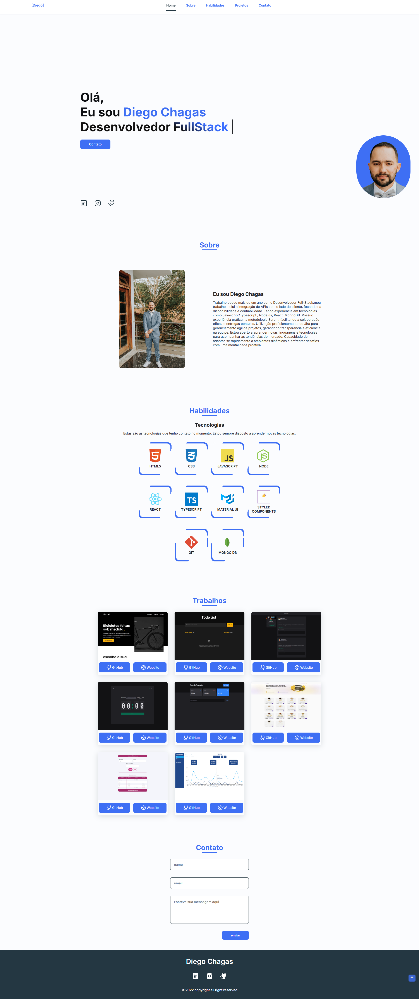

# Portifólio TypeScript 


Este é o repositório do meu portfólio profissional, desenvolvido com React e TypeScript. O projeto tem como objetivo apresentar meus trabalhos, competências técnicas e trajetória de forma moderna e responsiva.




## Tecnologias

Esse projeto foi desenvolvido com as seguintes tecnologias:

✔️TypeScript

✔️React-vite

✔️Styled-components

✔️Phosphor Icons

✔️ react-hook-form

✔️ zod

## ⚙ Configuração

```
- $ git clone https://github.com/diegofchagas/portifolio-update.git

- Para instalar as dependências:
> npm i

- Vá para a pasta do projeto

- Para iniciar a aplicação:
> npm run dev
```
<br/><br/>

## 🌐 Deploy
Este portfólio está hospedado em:

🔗 meusite.com.br <!-- Atualize com seu domínio -->

<br/>

## Desenvolvedor 
<span style="font-size: larger;">**Diego Chagas**</span>

